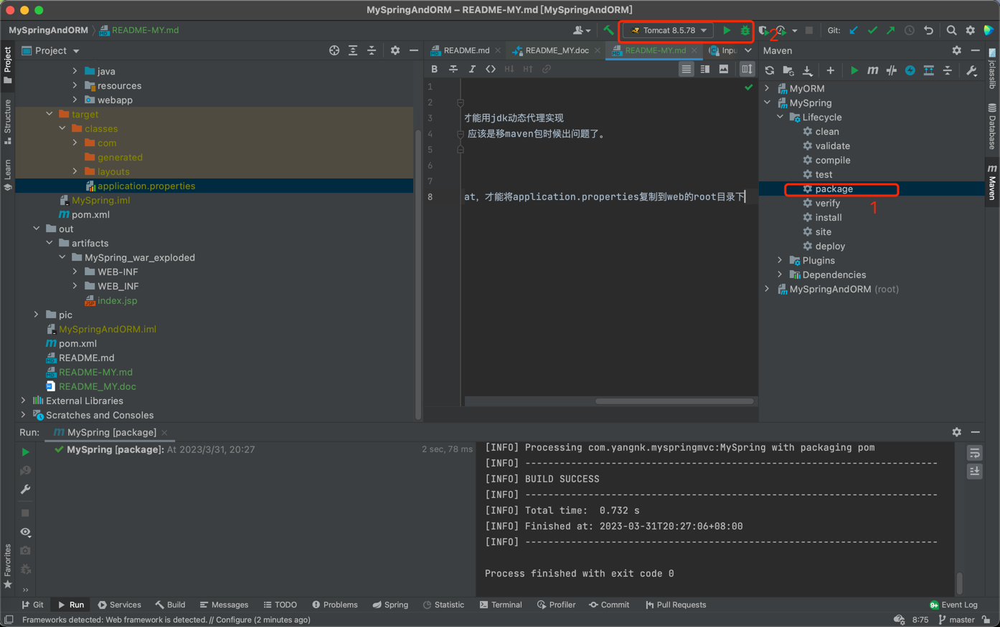

问题:
1. mvc中的url还是对应不上
1. aop中使用jdk动态代理的存在切点的类必须有接口才能用jdk动态代理实现
1. 修改成多module后，点击root目录下clear报错，应该是移maven包时候出问题了。

   
注意事项：
1. 必须要新执行maven的package，再执行运行tomcat，才能将application.properties复制到web的root目录下
