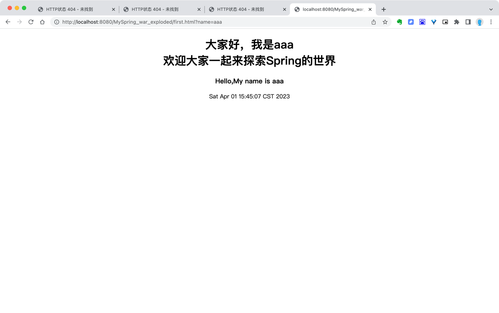

### 这是一个简易Spring 框架；

测试tomcat服务是否起来了：http://localhost:8080/MySpring_war_exploded/

测试spring mvc是否正常：
http://localhost:8080/MySpring_war_exploded/first.html?name=aaa

http://localhost:8080/MySpring_war_exploded/add?a=1&b=2
